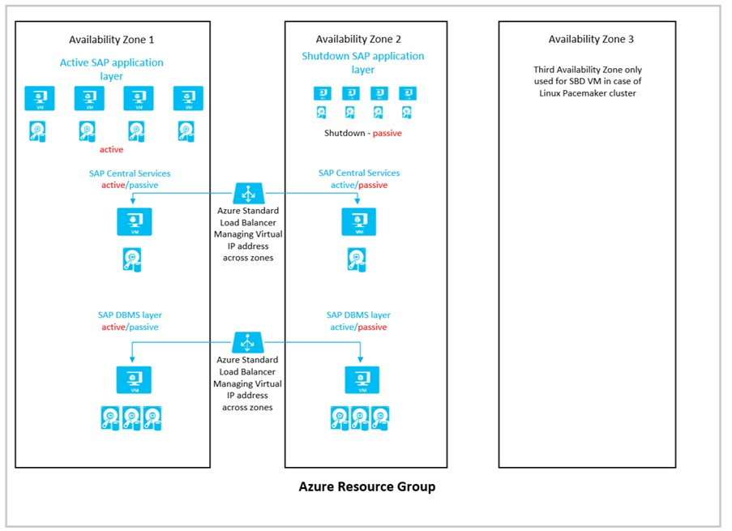
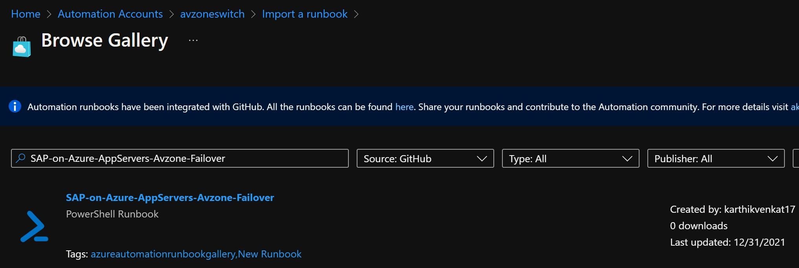
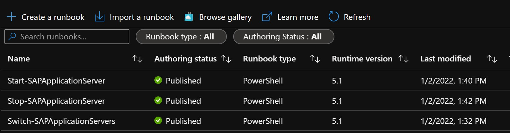

# SAP on Azure AppServers AvZone Switchover
## Overview ##

For SAP deployments on Azure using Availability zones, one of the architecture patterns is to have SAP application servers in Active/Passive mode as shown below. In an Active/Passive setup when database fails over from Zone 1 to Zone 2 in the picture below, SAP application servers need to switchover as well. This solution provides approach and code to facilitate this switchover in an automated way using Automation runbooks and Pacemaker Alert agent. 




## Pre-Requisites
- You have an SAP application deployed across Availability Zones in Active/Passive setup as described [here](https://docs.microsoft.com/en-us/azure/virtual-machines/workloads/sap/sap-ha-availability-zones#activepassive-deployment)
- SAP Database tier is running on Linux with HA configured across Availability Zones using Pacemaker. If database tier is on Windows or not using Pacemaker Cluster (For example Oracle dataguard) a different trigger mechanism need to be used in place of Pacemaker Alert agent. Runbook can still be used for Application server switch.
- Zone which hosts the passive node of the database has equal number of SAP application servers (as active Zone) built, configured (logon groups, batch groups, message server ACLs etc.) and shutdown. 
- The main runbook in this repo **Switch-SAPApplicationServers** leverages the [SAP Start Stop Automation Framework](https://github.com/Azure/SAP-on-Azure-Scripts-and-Utilities/tree/main/Start-Stop-Automation/Automation-Backend). Hence all Application servers need to have 3 mandatory tags mentioned below 
    | Tag | Explanation | Example |
   | --- | --- | --- |
  | SAPSystemSID | SID of SAP application | SBX | 
  | SAPApplicationInstanceType  | SAP_D or SAP_DVEBMGS (which signifies Dialog instances) | SAP_D |
  | SAPApplicationInstanceNumber | Instance number of SAP app server | 00 |

- Code assumes that Azure VM Name and hostname are identical. If these are different modify the runbooks accordingly.
- Code assumes that the database SID and application server SID are identical. If these are different modify the runbooks accordingly.  

## Code Walkthrough

***runbook-trigger.sh*** 
- This shell script will be used by the Alert agent of the Pacemaker cluster.  
- The script checks if the alert task is for a database node being **Promoted**. If yes actions mentioned below is carried out. If not no action is taken. 
- If CRM_alert_task contains **Promote**, the script creates a JSON file in the /tmp directory with values of Cluster type (not used currently in processing), Promoted VM, Demoted VM, SAP database SID. 
- Once the JSON file is created, the script does a POST of the JSON file to the **webhook** url of an Azure automation runbook using cURL. 

***Switch-SAPApplicationServers.ps1***
- This runbook takes the following parameters as inputs

| Parameter | Explanation |
| --- | --- |
| WebhookData | JSON with details of the switchover alert. Sample JSON {"ClusterType":"HANA","SAPSystemId":"ABC","PromotedNode":"xxxxxx","DemotedNode":"xxxxxx"} |
| automationaccount |  Specifies the automation account which hosts this runbook as well as Start-SAPApplicationServer and Stop-SAPApplicationServer runbooks |
| automationRG | Specifies the resource group of the automation account |
| runbookName | Specifies the name of this runbook. Used to check job concurrency |
| SAPApplicationServerWaitTime | Time to wait in Seconds when starting the SAP application Servers |
| SAPSoftShutdownTimeInSeconds | Softshutdown timeout in seconds used for stopping SAP application servers on the passive Zone |
| jobMaxRuntimeInSeconds | Max runtime for the job in seconds. |

- The runbook initially fetches the Zone details of Promoted and Demoted database VMs using the Get-AzVM command. 
- Once we have the Zone details, we then collect all SAP application servers for the particular SID using the Tags and segregate them to Zones. 
-  We first need to start all application servers on the newly Promoted AvZone. This is done by calling runbook Start-SAPApplicationServer.ps1 as child jobs for each of the application server.  Child jobs are all started in Parallel. 
-  We now wait for all jobs to come to a Terminal state. If all jobs Complete successfully we move to the next step. If any of the job fails we exit. 
-  Next step is to stop application servers on the newly Demoted AvZone. This is done by calling runbook Stop-SAPApplicationServer.ps1 using child jobs similar to above. 

## Implementation Steps
- Create an automation account and Import **Switch-SAPApplicationServers** runbook into your automation account.  Runbook can be imported using the source as Github and searching for the repo name. Use the powershell runtime version as 5.1.



- Import the powershell module SAPAzurePowerShellModules from the Powershell gallery into your Automation account. See [here](https://github.com/Azure/SAP-on-Azure-Scripts-and-Utilities/tree/main/Start-Stop-Automation/Automation-Backend#import-sap-powershell-module) for details. 
- Import runbooks **Start-SAPApplicationServer** and **Stop-SAPApplicationServer** into your automation account. These runbooks use RunAsAccount for authentication whereas the main runbook uses System-assigned Managed Identity for authentication. Comment the lines for authentication using RunAsAccount in these 2 runbooks and add code to use system-assigned managed identity as shown below.  Alternately create a RunAsAccount within the Automation Account.  

**Comment the below lines**
```
#$connection = Get-AutomationConnection -Name AzureRunAsConnection
#Add-AzAccount  -ServicePrincipal -Tenant $connection.TenantID -ApplicationId $connection.ApplicationID -CertificateThumbprint $connection.CertificateThumbprint 
```
**Add the below lines for system assigned managed identity authentication**
```
# Ensures you do not inherit an AzContext in your runbook
Disable-AzContextAutosave -Scope Process
# Connect to Azure with system-assigned managed identity
$AzureContext = (Connect-AzAccount -Identity).context
$AzureContext = Set-AzContext -SubscriptionName $AzureContext.Subscription -DefaultProfile $AzureContext
Write-Output "Working on subscription $($AzureContext.Subscription) and tenant $($AzureContext.Tenant)"
```
- Your Automation account should now have 3 runbooks in published state.



- The managed identity associated with the automation account needs access to check status of jobs in the automation account, read VM properties of the DB and app server VMs, stop/start app server VMs, invoke OS commands on the application servers using Invoke-AzVMRunCommand. Add role assignments which provides these authorizations.
- To trigger the runbook from pacemaker cluster, create a webhook for main runbook **Switch-SAPApplicationServers**.  Populate all parameters for the runbook at the time of creation of webhook except WEBHOOKDATA. WEBHOOKDATA will be passed by pacemaker alert agent script. 
- Secure the webhook using **Private Endpoint**.  Run a test of the webhook using POSTMAN or a similar tool. 
- Logon to the database VMs and place the runbook-trigger.sh shell script in the same path in both the VMs. Ensure that **hacluster** user can execute the script and can also write files to the /tmp directory.
- Update the shell script to use the webhook url created in the previous step.
-  Create an alert agent resource on the pacemaker. Below is an example screenshot from SUSE using CRM command.

-  Execute a failover of the database.  You should see that the alert gets triggered and runbook is started using the webhook.  Output of the alert agent script and JSON file can be found in the /tmp directory. Check the logs of runbook to ensure switchover behaves as expected.